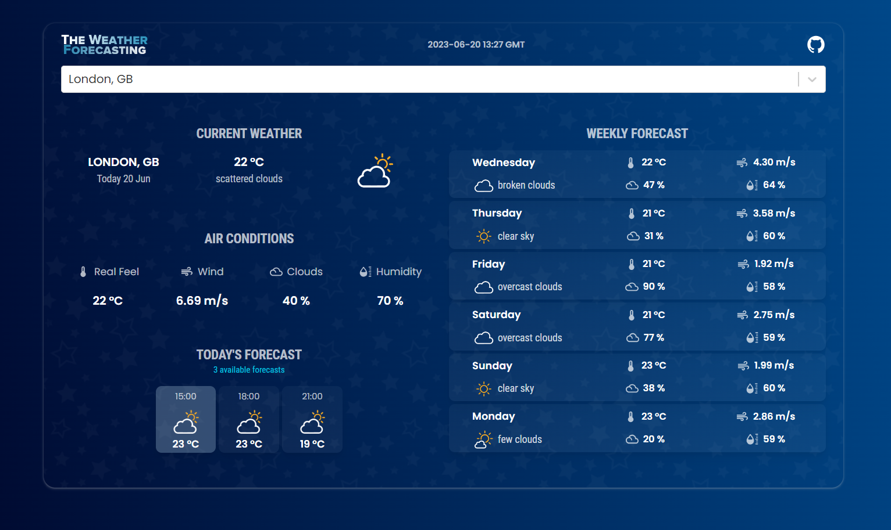

 
 

# 🌤️ The Weather Forecasting

**The Weather Forecasting** is a modern web application that allows users to search for any city and view detailed weather forecasts. It provides a 5-day forecast broken down into 3-hour intervals, displaying weather icons and descriptions for each time slot.

## 🔍 Features

- Search weather by **city name**
- View forecast in **3-hour intervals** for the next **5-6 days**
- Weather icons and descriptions included
- Responsive design for desktop and mobile

## 🚀 Live Demo

[🌐 View App](https://the-weather-forecasting.netlify.app)

## 🛠️ Tech Stack

- **Frontend Framework**: [React.js](https://reactjs.org/)
- **UI Components**: [Material UI](https://mui.com/)
- **API**: [OpenWeatherMap API](https://openweathermap.org/forecast5)

## 🧩 Project Structure

- `src/components`: Reusable UI components like search bar, weather cards, etc.
- `src/api/OpenWeatherService.js`: Handles communication with OpenWeatherMap API.
